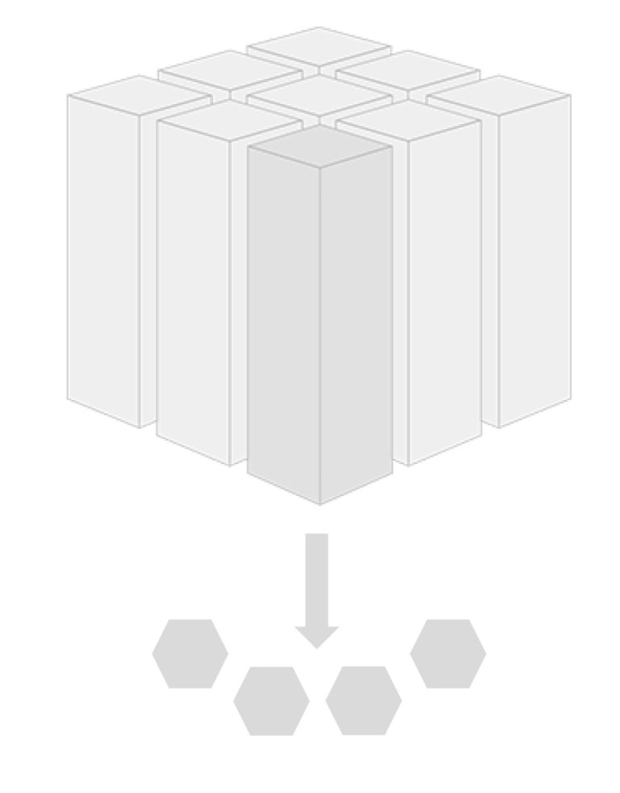

:description: This document illustrates the concepts of a self contained system.
:organization: Vanderlande
:doctype: book
:toc: left
:toc-title: Table of Contents
:toclevels: 5
:sectnumlevels: 8
:sectnums:
:icons: font

= Vanderlande Demo SCS

Author: <marc.heimann@vanderlande.com>

Last update: {docdate}

include::chapters/introduction_and_goals.adoc[]
include::chapters/prerequisites.adoc[]
include::chapters/rest_api.adoc[]